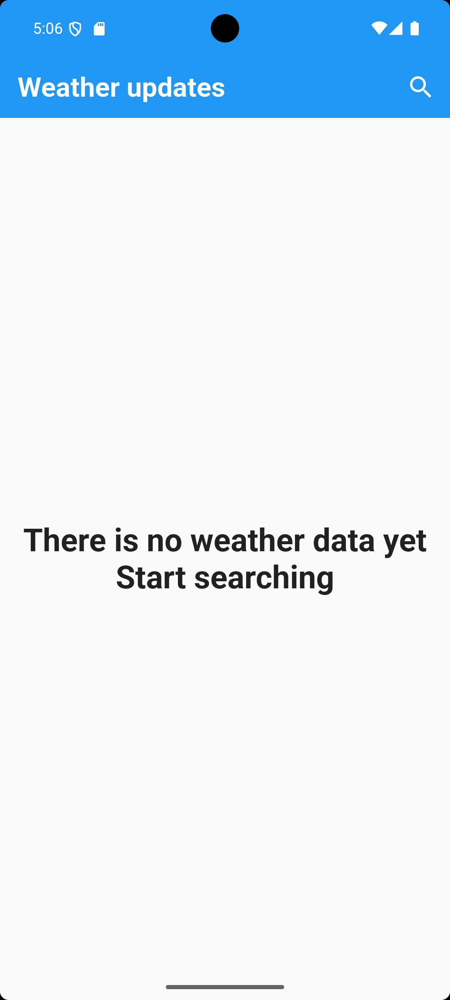
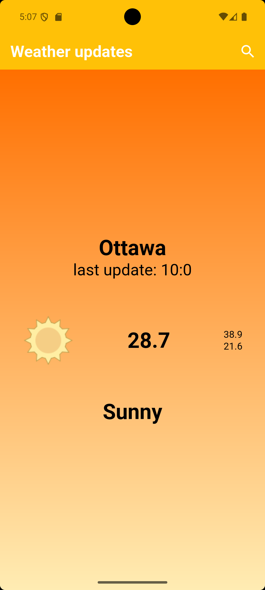
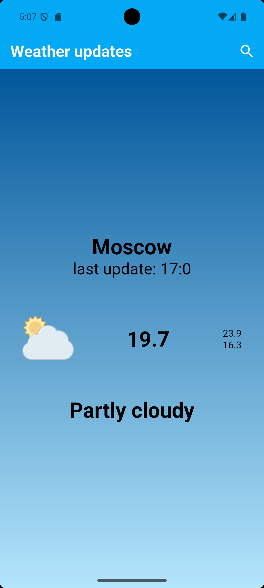
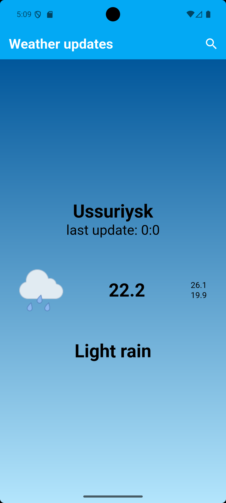
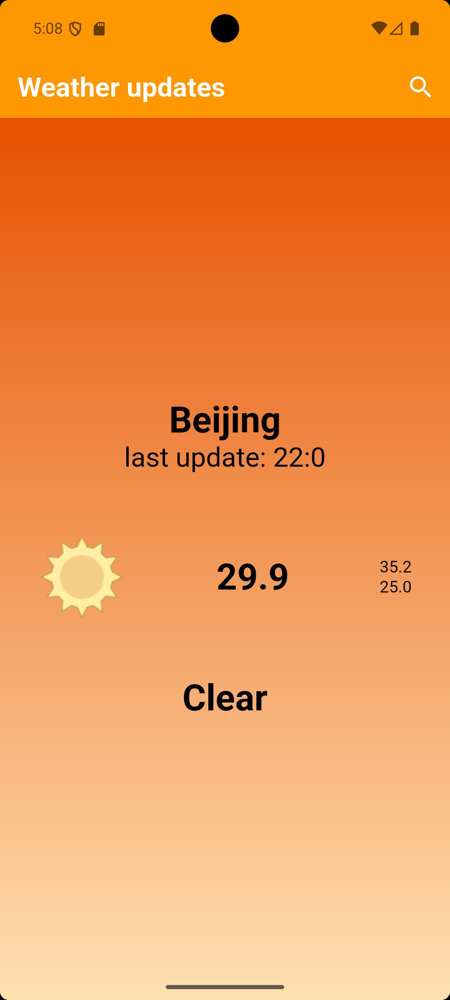
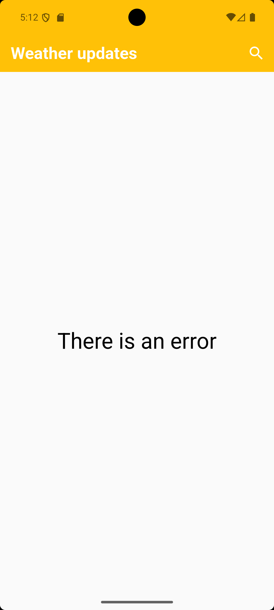

# 🌦 Weather App

A modern Flutter weather application that provides real-time weather information for any city using the WeatherAPI service.

The application is built following a clean Flutter architecture with **Cubit (flutter_bloc)** for state management and **Dio** for networking.

---

## 📱 Preview

### Home Screen

<p align="center">
  
</p>

---

### Sunny Weather

<p align="center">
  
</p>

---

### Cloudy Weather

<p align="center">
  
</p>

---

### Light Rain

<p align="center">
  
</p>

---

### Clear Weather

<p align="center">
  
</p>

---

### Error State

<p align="center">
  
</p>

---

# ✨ Features

- 🌍 Search weather by city name
- ☀️ Current weather information
- 🌡 Display:
  - Maximum Temperature
  - Average Temperature
  - Minimum Temperature
- 🕒 Last updated time
- ☁️ Weather condition icon
- 🎨 Dynamic application theme based on weather condition
- ⚡ Fast API requests using Dio
- 🔄 State management using Cubit (flutter_bloc)
- ❌ Error handling for invalid city names
- 🧩 Clean and organized project structure

---

# 🏗 Project Structure

```
lib
│
├── cubits
│   └── weather_cubit
│       ├── get_weather_cubit.dart
│       └── get_weather_states.dart
│
├── models
│   └── weather_model.dart
│
├── services
│   └── weather_service.dart
│
├── views
│   ├── home_view.dart
│   └── search_view.dart
│
├── widgets
│   ├── display_condition_icon.dart
│   ├── display_weather_info.dart
│   └── no_weather_info.dart
│
└── main.dart
```

---

# 🧠 State Management

The application uses **Cubit** from **flutter_bloc**.

States:

- NoWeatherState
- LoadedWeatherState
- WeatherFailureState

The Cubit is responsible for:

- Fetching weather data
- Managing loading and error states
- Updating the UI automatically
- Changing the application's theme dynamically

---

# 🌐 API

This project uses:

**WeatherAPI**

https://www.weatherapi.com/

Endpoint used:

```
/forecast.json
```

---

# 📦 Packages Used

| Package | Purpose |
|---------|---------|
| flutter_bloc | State Management |
| bloc | Cubit |
| dio | HTTP Requests |

---

# 🎨 Dynamic Theme

One of the interesting features of this project is that the application theme changes automatically according to the current weather condition.

Examples:

- ☀️ Sunny → Amber
- ☁️ Cloudy → Blue Grey
- 🌧 Rain → Blue
- ❄️ Snow → Cyan
- ⛈ Thunderstorm → Deep Purple
- 🌫 Fog → Grey

This makes the application feel more dynamic and visually engaging.

---

# 🚀 Getting Started

Clone the repository

```bash
git clone https://github.com/Muhammadkhiry/weather_app.git
```

Install dependencies

```bash
flutter pub get
```

Run the application

```bash
flutter run
```

---

# 📌 Future Improvements

- 📍 Current location support (GPS)
- 🗓 7-day forecast
- ⏰ Hourly forecast
- ❤️ Favorite cities
- 🌙 Dark Mode
- 🌡 Temperature unit switching (°C / °F)
- 🌍 Multi-language support
- 💾 Local caching

---

# 👨‍💻 Author

**Muhammad Khiry**

GitHub:
https://github.com/Muhammadkhiry

---

## ⭐ If you like this project, don't forget to leave a star on the repository!